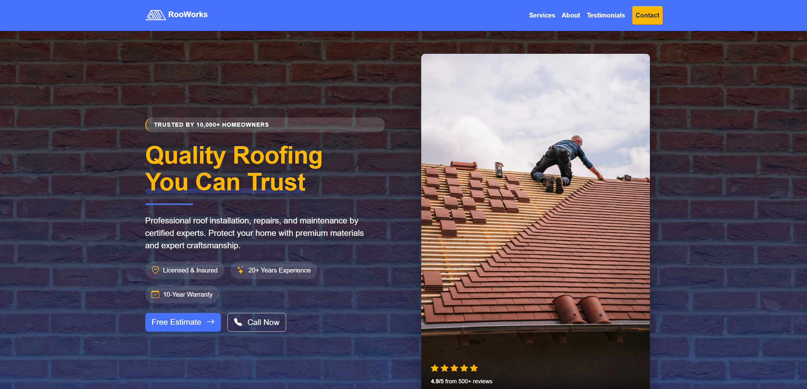

# RooWorks Bootstrap 5 Template.

## Overview

**RooWorks** is a professionally designed website for a roofing company, focusing on a premium yet friendly user experience. The site leverages a modern responsive design with a clean layout, accessible navigation, and compelling visual elements to help build trust with potential clients.

---

## Design Highlights

- **Modern, Responsive Layout:**  
  The site is built using Bootstrap, adapting gracefully to all screen sizes—desktop, tablet, and mobile—ensuring accessibility for every user.

- **Custom Branding:**  
  A cohesive visual identity is achieved through carefully selected color palettes, custom iconography (via Bootstrap Icons), and a distinctive logo section.

- **Hero Section with Social Proof:**  
  The homepage greets users with a bold headline, social trust indicators (e.g., “Trusted by 10,000+ Homeowners”, “4.9/5 from 500+ reviews”), and visible calls to action for “Free Estimate” and “Call Now”.

- **Feature Badges:**  
  Quick visual highlights communicate licensing, years of experience, and warranty offerings at a glance.

- **Service Cards:**  
  Service offerings are visually grouped in easy-to-scan cards with clear titles, brief descriptions, feature lists, and action buttons linking to contact forms.

- **Specialty Services:**  
  In addition to the main services, specialty offerings such as Gutter Installation, Ice Dam Prevention, and Skylight Installation are surfaced for added value.

- **Testimonials & Trust Elements:**  
  The site includes dedicated sections for customer reviews, awards, and other credibility-boosting content.

- **Accessibility:**  
  Semantic HTML and ARIA-friendly markup ensure that the site is navigable by screen readers.

---

## Key Features

- Professional navigation bar with brand integration and mobile menu support.
- Dynamic hero section with background image, overlay, rating stars, and key messaging.
- Service spotlight cards, feature lists, and prominent action buttons.
- Highlighted specialty services with supporting icons.
- Contact and estimate prompts placed strategically for optimal conversion.
- Integration-ready architecture for testimonials, project showcases, and other dynamic content sections.

---

## Getting Started

1. Clone or download this repository.
2. Open `index.html` in your browser to view the site locally.
3. Customize branding, text, images, or add new features as needed.

---

## Customization

- **Colors & Fonts:**  
  Adjust Bootstrap theme variables or enhance CSS in `css/core.css` for further personalization.
- **Images:**  
  All major sections use the `images` folder—replace or add to these as appropriate.
- **Features:**  
  Additional service cards, reviews, or contact integrations can be easily added or modified in the appropriate HTML and CSS files.

---

## License
- License Type: MIT
- Website content and structure are free to use and modify for personal or commercial purposes.
